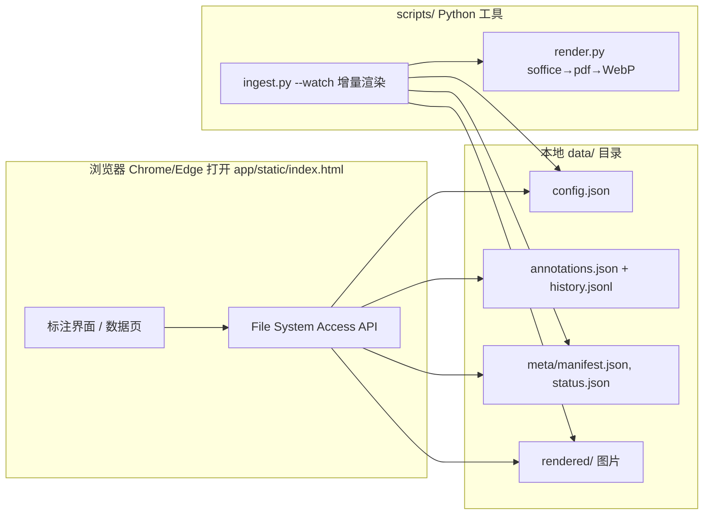

# PPT 盲测对照标注平台

纯前端（无后端）的 PPT 盲测对照标注工具：把同一份幻灯片（Deck）的多种生成方法（数据源 / 方法）并排展示，标注人**看不到来源**（仅显示「样本 N」），逐页对比、打分、选最优 / 最差，支持 1–5 分。数据存本地 JSON，浏览器通过 **File System Access API** 读写本地 `data/` 目录。

## 特性

- 目录授权一次，IndexedDB 记住句柄，刷新 / 重开自动恢复
- 侧栏 Deck 列表：快速跳转、状态徽标（待处理 ● / 草稿 ● / 完成 ✓）、筛选（全部 / 待完成 / 已完成）
- 标注画布：自由卡片（拖动 / 八向缩放 / 允许重叠 / 自动排列 / 1–4 列版式 / 滚轮翻页）
- 盲测约束：不显示数据源名，仅显示「样本 N」；可选随机顺序；同步翻页
- 保存时机：手动保存 + 切换 Deck / 关闭时自动 flush，未保存有关闭提醒
- 数据页：Deck×数据源矩阵 / 数据源汇总，按状态**多选**筛选，增删渲染组（写 `config.json`），一键刷新
- 清空标注（当前 / 全部）、标注导入导出、操作日志（localStorage）
- 后端增量渲染：`ingest --watch` 监视源文件变化自动重渲，断点续跑，原子写（读写并发安全，不产生半成品 / 碎片文件）

## 技术架构



- 前端：`app/static/`，无构建步骤，直接打开 `index.html`
- 后端：`scripts/`，仅做渲染 / 建清单，不提供 HTTP
- 运行产物与本地配置（`data/`、`reports/`、`tests/`、`docs/.build/`、`pytest.ini` 等）已 git 忽略，不入库

## 目录结构

```
ppt-blind-annotator/
├─ app/static/                # 前端（无构建）
│  ├─ index.html
│  ├─ css/app.css
│  └─ js/
│     ├─ fsaccess.js          # FS Access 封装（授权/读写/原子写/追加）
│     ├─ app.js               # 入口、路由、数据页、操作日志
│     ├─ annotate.js          # 标注画布（卡片/翻页/保存）
│     ├─ explorer.js          # 侧栏 Deck 列表
│     └─ report.js            # 报告视图（M3）
├─ scripts/                   # Python 工具
│  ├─ ingest.py               # 扫描/归组/渲染/建清单，--watch 增量
│  ├─ render.py               # soffice→pdf→PyMuPDF→WebP（staging 提交）
│  ├─ launch.py               # 一键启动：ingest --watch + 打开浏览器
│  ├─ make_demo.py            # 生成 4 组演示 pptx
│  ├─ atomic.py               # 原子写（os.replace）
│  ├─ paths.py / constants.py
├─ requirements.txt
└─ README.md                  # 本文档（人类可读总文档）
```

## 快速开始

1. **安装依赖**
   - 系统：`libreoffice`（提供 `soffice`，渲染用）
   - Python：`pip install -r requirements.txt`（pymupdf / Pillow / python-pptx / pytest / unoserver）

2. **准备数据**（二选一）
   - 用现成源文件：构造 `data/config.json`（构造示例见下）指向各数据源目录
   - 或生成演示数据：`python scripts/make_demo.py`

3. **启动**
   - 一键：`python scripts/launch.py`（后台跑 ingest --watch + 自动打开浏览器）
   - 或手动：终端跑 `python -m scripts.ingest --config data/config.json --watch`，再用 Chrome / Edge 打开 `app/static/index.html`

4. **授权**：页面首次打开时点右上角「data 目录」，选择项目的 `data/` 文件夹（之后自动记住）

## 常用命令

| 命令 | 说明 |
| --- | --- |
| `python scripts/launch.py` | 一键启动（ingest --watch 后台 + 打开前端） |
| `python -m scripts.ingest --config data/config.json --watch` | 增量渲染，持续监视 |
| `python -m scripts.ingest --config data/config.json` | 单次渲染后退出 |
| `python scripts/make_demo.py` | 生成 4 组演示 pptx（methodA~D） |
| `kill <ingest_pid>` | 停止 ingest --watch |

## 数据目录构造示例

> `data/` 等为运行产物目录，不入库；此处给出**构造方式示例**，便于新环境重建。

```jsonc
// data/config.json —— 数据源列表（渲染组）+ 全局偏好
{
  "datasets": [
    { "name": "methodA", "path": "/abs/path/to/data/demo/methodA", "sort_order": 0 },
    { "name": "methodB", "path": "/abs/path/to/data/demo/methodB", "sort_order": 1 }
  ],
  "prefs": { "shuffle": false, "sync_page": true }
}
```

```
data/
├─ config.json                 # 上例（可由数据页「提交修改」自动写）
├─ annotations.json            # 当前标注（前端写入）
├─ annotations_history.jsonl   # 标注历史追加日志（前端写入）
├─ demo/                       # 源 pptx（可放任意路径，仅需 config 指对）
│  ├─ methodA/slide_001.pptx
│  ├─ methodA/slide_002.pptx
│  └─ methodB/...
├─ meta/                       # ingest 生成
│  ├─ manifest.json
│  └─ status.json
└─ rendered/                   # ingest 生成：<数据源>/<Deck>/page_*.webp
```

## 里程碑状态

| 阶段 | 内容 | 状态 |
| --- | --- | --- |
| M0 骨架 | 扫描 / 归组 / 建清单（manifest/status） | ✅ 已完成 |
| M1 渲染管线 | soffice→pdf→WebP 增量渲染、断点续跑、原子写 | ✅ 已完成 |
| M2 标注前端 | 盲测画布 + Deck 列表 + 数据页 | ✅ 已完成 |
| M3 报告生成 | report.py 聚合输出 HTML/CSV/JSON | ⬜ 下一步 |
| M4 性能与打包 | 虚拟滚动、千级懒加载、压测 | ⬜ 未开始 |

> 面向后续开发的详细文档（规划 / 进度 / 交接）在 `docs/.build/`（git 忽略，不入库）。
